# REPORT 1

Eva Kaštelan (232469), Noa Margeta (232470), Filip Penzar (232452)\
Group 127

---

## Description of the Dataset

This dataset contains a wide range of information about countries worldwide.
It covers every country globally and its attributes serve as basic categories describing each country. Categories include demographic statistics, healthcare metrics, economic indicators, education statistics, environmental data, and others. The global-wide inclusion of all countries allows for a wide perspective that can be used for in-depth analyses and cross-country comparisons.

The dataset can be obtained at [kaggle](https://www.kaggle.com/datasets/nelgiriyewithana/countries-of-the-world-2023).

### Previous Data Analysis Projects

This [data analysis](https://www.kaggle.com/code/amgedelshiekh/continent-level-eda#1.-GDP) does an exploratory data analysis utilizing statistical graphics and other data visualization methods. Its analysis is divided into 3 overarching categories hoping to look closer into GDP, Good place to live in, and Gasoline prices. The first subsection of the work considers several different relations that the author hypothesizes to be relevant to the GDP attribute. (GDP - Population, GDP - Fertility rate, Industrialization - Agriculture, GDP - Taxes, GDP - Army). The subsection begins by noting a linear relationship between population and GDP. Contrary to expectations, it finds no correlation between fertility rates and GDP in Europe, while other continents show a negative correlation. The subsection also highlights a strong 92% correlation between GDP and CO2 emissions, emphasizing that economic growth often leads to increased pollution. This correlation extends to the percentage of urban population and CO2 emissions, indicating the environmental challenges posed by urbanization. Regarding land use, there's no significant correlation between GDP and the percentage of agricultural land, except for Oceania, where a reversal relationship exists, and South America, where a positive correlation is observed.
The role of taxes in nation-building is discussed, with negative correlations between tax revenue and GDP in Asia, North America, and South America, but a positive correlation in Oceania. No clear correlation is found in Europe and Africa. Lastly, the exponential relationship with the Army suggests that economic growth often leads to increased defense spending. In the second subsection relations, which are assumed to bring about a better life, are being analyzed. The analysis compares the minimum wage, post-tax minimum wage, higher education enrollment, out-of-pocket health expenditure, and other attributes to the countries' GDP. In it positive correlations are shown between post-tax minimum wage and GDP per population, minimum wage and GDP, higher education enrollment and individual GDP, as well as healthcare and GDP. Conversely, negative correlations are observed between taxation and minimum wage, suggesting that in some countries with high tax rates, the minimum wage is lower. Additionally, there is a strong negative correlation between life expectancy and fertility rates, implying that as one rises, the other declines. Primary education does not have a specified correlation in the text. The final subsection explores the attributes tax money, minimum wage, and CPI in relation to the Gasoline prices in the country. What the further analysis shows is a strong positive correlation between Tax revenue and minimum wage factors and Gasoline Prices, outside Africa. The opposite is ascertained for the consumer price index.

### Project Goals

This project focuses on the manipulation, examination, description, and visualization of the data in order to provide a solid starting point for the upcoming project, in which the focus will be on classification and regression models.

#### Classification
Classification models are used to categorize data into predefined classes or categories.
For the classification problem, the goal will be to create such a model that can predict the continent a country is on (`Continent` the chosen class label attribute), based on several other features. 
The attributes will include:

* GDP
* Life Expectancy
* Physicians per thousand people
* Gross Primary Education Enrollment
* Gross Tertiary Education Enrollment
* Infant Mortality
* CPI
* Agricultural Land
* Density
* Birth rate
* Forested area
* Gasoline price
* Maternal mortality ratio
* Unemployment rate
* Urban population
* Population
* Physicians per thousand people

#### Regression

Regression models are used to predict a continuous numeric value based on input features. 
For the regression problem, the goal will be to predict the value of `Gross Tertiary Education Enrollment`. Attributes used for the prediction will include:

* GDP
* Life Expectancy
* Continent
* Physicians per thousand people
* Gross Primary Education Enrollment
* Gross Tertiary Education Enrollment
* Infant Mortality
* CPI
* Agricultural Land
* Density
* Birth rate
* Gasoline price
* Maternal mortality ratio
* Unemployment rate
* Urban population
* Population
* Physicians per thousand people

## Detailed Explanation of the Data Attributes

A basic description of the relevant attributes is shown in the following table:

| Attribute | Details |   | Attribute type   |
|:---|:---|:---:|:---:|
| Country | Country name |discrete|nominal|
| Agricultural Land | Percentage of land area used for agricultural purposes (%) |continuous|ratio|
| Birth rate|  Number of births per 1,000 population per year |continuous|ratio|
| Continent| Continent name of country |discrete|nominal|
| CPI | Consumer Price Index, a measure of inflation and purchasing power |continuous|ratio|
|Fertility Rate | Average number of children born to a woman during her lifetime | continuous | ration|
|Forested Area |Percentage of land area covered by forests (%) | continuous | ratio |
| Density| Population density measured in persons per square kilometer (P/Km2) |continuous|ratio|
| GDP | Gross Domestic Product, the total value of goods and services produced in the country |continuous|ratio|
| Gasoline price| Price of gasoline per liter in local currency  |continuous|ratio|
| Gross Primary Education Enrollment |Gross enrollment ratio for primary education (%) |continuous|ratio|
| Gross Tertiary Education Enrollment| Gross enrollment ratio for tertiary education (%) |continuous|ratio|
| Infant Mortality| Number of deaths per 1,000 live births before reaching one year of age |continuous|ratio|
| Life Expectancy |Average number of years a newborn is expected to live.  |continuous|ratio|
| Maternal mortality ratio | Number of maternal deaths per 100,000 live births |continuous|ratio|
| Physicians per thousand people| Number of physicians per thousand people  |continuous|ratio|
| Population | Total population of the country |continuous|ratio|
| Unemployment rate| Percentage of the labor force that is unemployed |continuous|ratio|
| Urban population | Percentage of the population living in urban areas |continuous|ratio|

#### Data Transformation

There was a number of data transformations performed. Some of the variables were removed all together, mostly due to a large number of null values within the dataset (e.g. `Minimum wage`, 23% null values - Denmark does not have a statutory minimum wage). Extrapolating the missing values would introduce unnecessary bias to the dataset. Some were removed because they were irrelevant to the project goals (`Calling code`, `Currency code`, `Largest city`, `Official language`). `Latitude` and `Longitude` were removed due to their close connection with the continent attribute - based on these attributes alone it would be possible to predict the continent.\
Since the original dataset did not come with the attribute that described the continent a country is on, the attribute needed to be added. This was done with a [python library](https://pypi.org/project/pycountry-convert/). After the addition, one-hot encoding was used for the continents, thus introducing 6 (Antarctica was not added) new attributes per country.\
Countries that contained null values within the remaining attributes were removed (36 countries). Again, this was done so as not to introduce any bias. In the end the cleaned dataset contained 159 countries.

#### Basic summary statistics of the attributes

This subsection of the report focuses on the more elementary properties and definitions of the dataset that summarize attributes of the dataset and give way for future observation comparisons.

The attribute statistics are laid out in table form below (Table 2.). 
Shown are the empirical mean, empirical standard deviation, median, and value range of every used attribute of the dataset.

|Attribute | empirical mean | empirical std deviation | median | range |
|:--- | :---: | :---: | :---: | :---: |
|Density (P/Km2)| 214.333 |709.831 |83.000 |8356.000 |
|Agricultural Land( %)| 39.029 |21.869 |39.500 |82.000 |
|Birth Rate| 20.143 |9.911 |17.950 |39.680 |
|CPI| 170.921 |232.890 |128.850 |2641.240 |
|Fertility Rate| 2.664 |1.279 |2.220 |5.930 |
|Forested Area (%)| 30.026 |22.806 |31.100 |98.300 |
|Gasoline Price| 0.989 |0.346 |0.980 |1.810 |
|GDP| 576652125538.623 |2382682486202.203 |53742159517.000 |21426849344983.000 |
|Gross primary education(%)| 103.360 |11.348 |102.500 |67.800 |
|Gross tertiary education(%)| 39.473 |29.112 |34.600 |135.800 |
|Infant mortality| 20.788 |19.406 |13.600 |83.100 |
|Life expectancy| 72.624 |7.516 |74.300 |31.400 |
|Maternal mortality ratio| 153.138 |222.200 |46.000 |1138.000 |
|Physicians per thousand| 1.826 |1.580 |1.570 |7.110 |
|Population| 47152268.333 |159265753.035 |10669709.000 |1397532210.000 |
|Unemployment rate| 6.889 |5.015 |5.390 |28.090 |
|Urban_population| 26180340.145 |81911516.515 |5648149.000 |842899682.000 |

A good way to show the influence one attribute has on another i.e. their mutual relation is through calculating their covariance.
Covariance is a measure of the strength and direction of the attributes' linear relationship. While useful, it is strongly affected by the scale of each attribute.
By standardizing its value we get the correlation of the attributes that still tells us of the direction of the linear relationship.
The following images (Image 2 and Image 3) show the covariance and correlation matrices of our dataset's attributes.

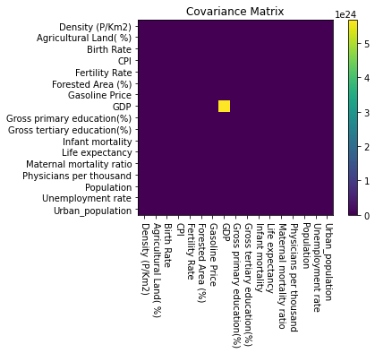
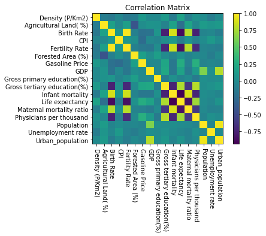

#### Data visualization

In this section the attributes are presented, both individually and in comparison to each-other.
Because of the great number of attributes in the dataset only a few interesting ones are visualized with histograms and box-plots.

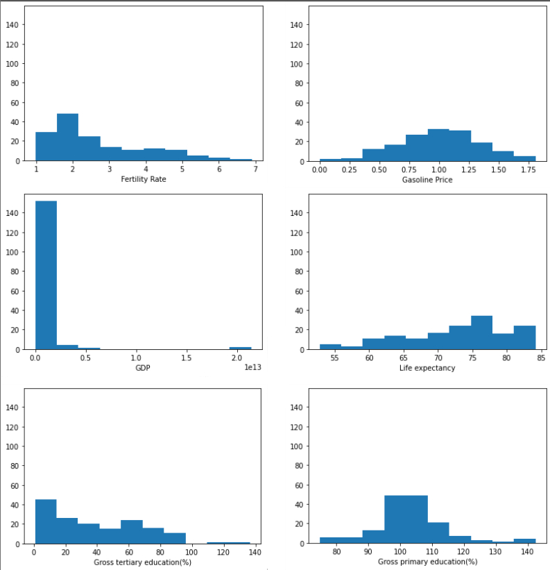

Two of the attributes, gasoline price and gross primary education have an approximately normal distribution. Fertility rate appears to be skewed to the right while life expectancy appears to be skewed to the left. Maybe the most interesting attribute is GDP, because of the large difference in values (the difference between the highest and lowest GDP is 21,426,849,344,983). It appears as if it has some evident outliers, but in fact, all of the values are true.

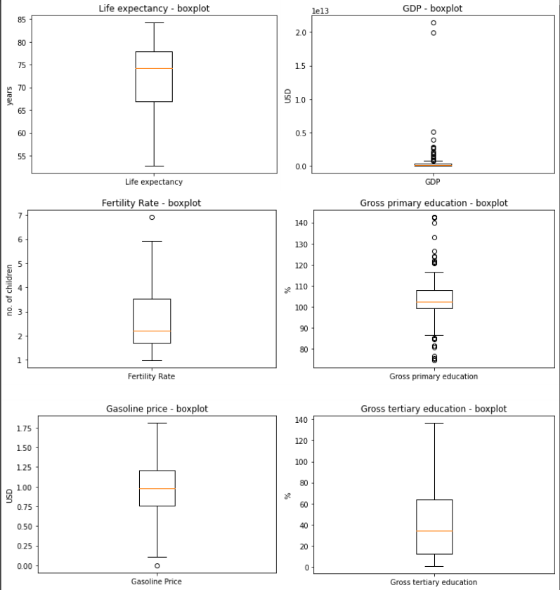

Coutries like the U.S., China, Japan, Germany, U.K., France, India, South Korea, Italy..., have extremly large values of GDP (many of them are members of G8) and subsequently look like outliers in the box-plot. They are not outliers, but rather valuable data points and because of this they are left in the dataset. 

Again because of the great number of attributes, a few interesting correlations are featured in graphs 2., 3. and 4.
They show the relations between strongly correlated chosen attributes. 

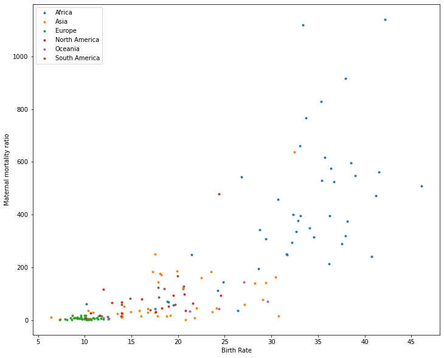 
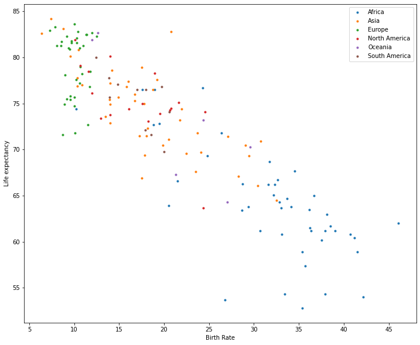 
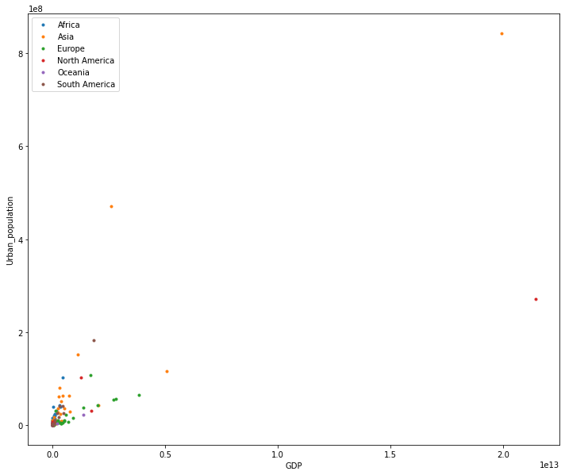 

The first 2 graphs tell the story of the natality and lifespan in a country. Graph 1 displays a positive correlation between the Birth rate and Maternal mortality ratio of a place while Graph 2 points out the inverse proportionality of the Birth rate and Life expectancy. Another interesting relationship is found between the attributes GDP and Urban population that is found to be proportionate. The part that intrigues most is the possible interpretations of the quality of life in countries that can be gathered from these relations.

In the following part of the section, the relationships with the Gross Tertiary Education Enrollment attribute and other attributes are highlighted.
Since it's the attribute that the future regression models will try to predict, a visualization through scatter graphs of its relations could help in determining the feasibility of the task.

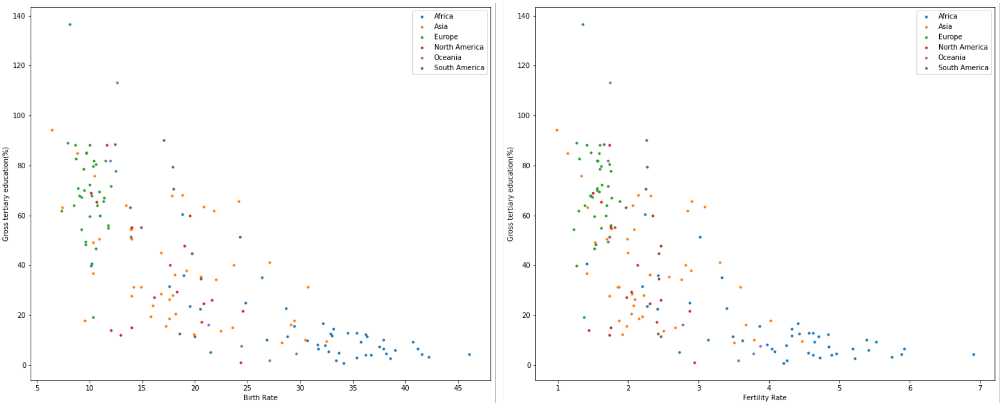
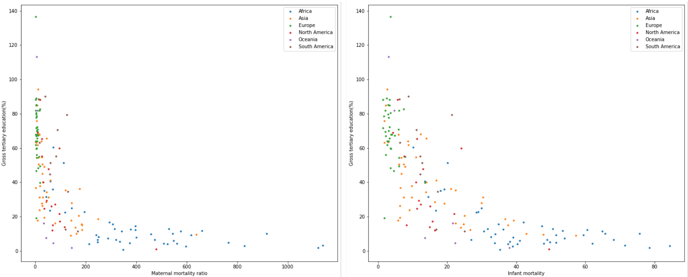
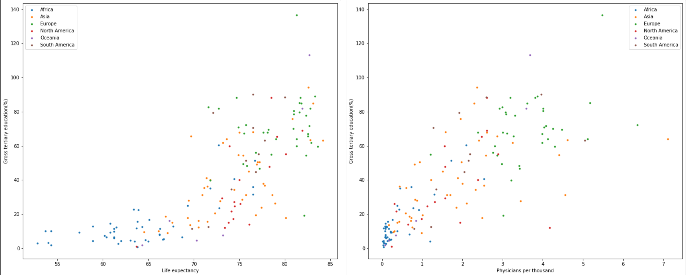
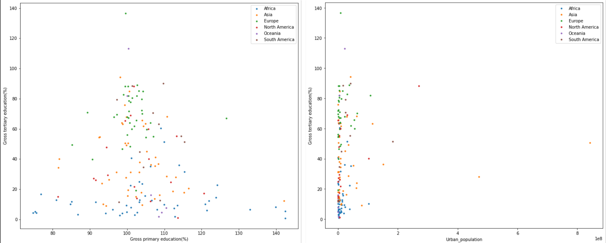
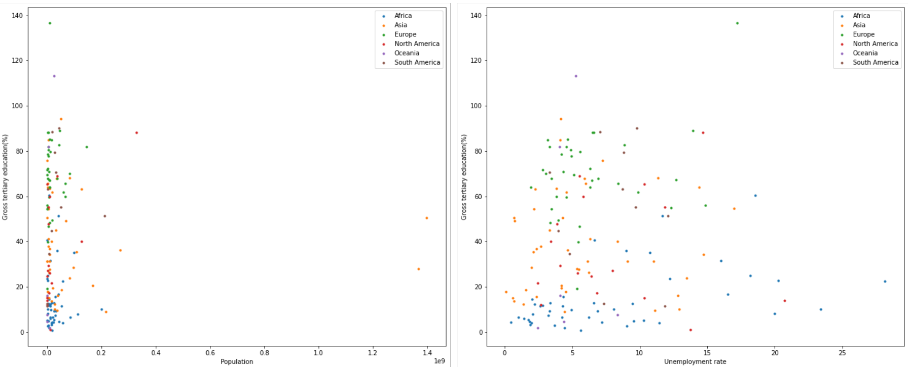
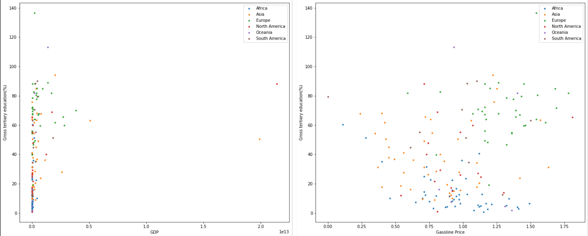
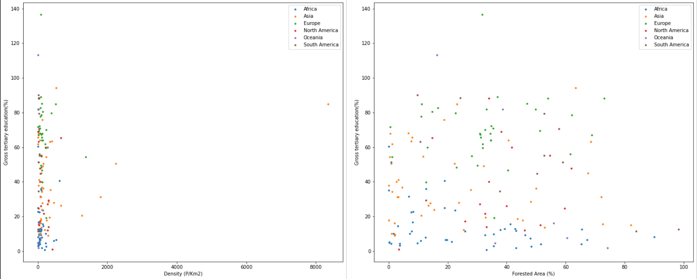
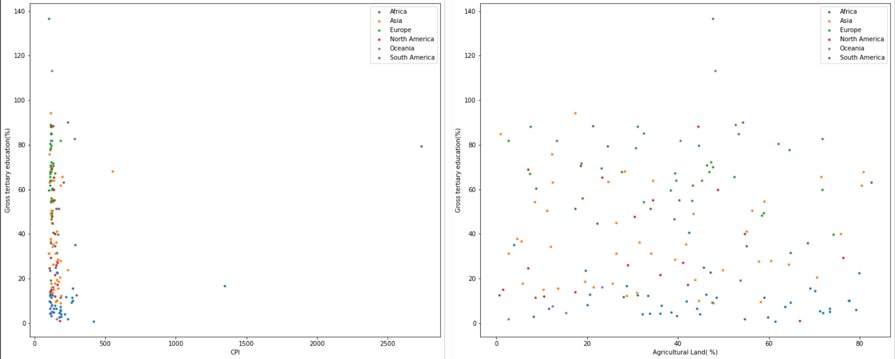

On the graphs, an obvious and "steeply" inversely proportional relationship between the Gross Tertiary Education Enrollment attribute and the Birth rate, Fertility rate, Infant mortality and Maternal mortality attributes can be noticed. On the other hand, the Life expectancy and Physicians per thousand people data shows a proportional growth with Tertiary Education.

Based on these graphs and the Correlation Matrix, Gross Tertiary Education Enrollment has a clear connection (correlation, but not necessarily linear) with a number of other attributes. Because of this, it should be possible to predict the value of Gross Tertiary Education Enrollment attribute with regression models.

#### PCA

Since the attributes had different scales, standardization was applied on all of them. Using the [scipy function svd](https://docs.scipy.org/doc/scipy/reference/generated/scipy.linalg.svd.html), svd was done on the dataset which enabled for a principal component analysis.\
As can be seen in the figure below, first 8 Principal Components (PCs), explain more than 90% of data variation. First PC explains roughly 35%, second PC explains 15% and third 8%. \
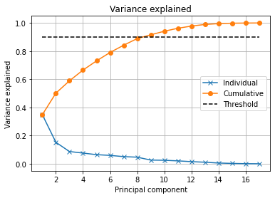\
The following figure visualizes the directions of the PCs.\
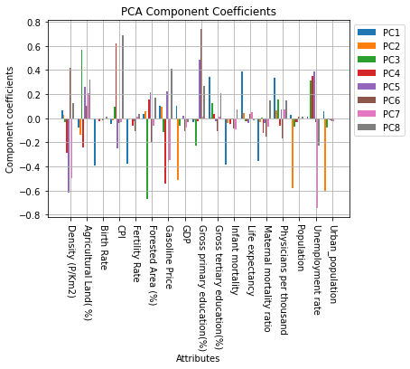\
For **PC 1**, `Birth Rate`, `Fertility Rate`, `Infant Mortality` and `Maternal Mortality` have a high negative coefficient associated with them, meaning a large positive value of those variables will result in a negative PC 1 result. This could be interpreted as a strong discrimination between countries based on natality. `Life Expectancy` and `Physicians per thousand` have high positive coefficients, meaning a discrimination based on healthcare. `Gross Tertiary Education`, `GDP` and `Gasoline Price` also have realtively high positive coefficients which could be explained as discrimination based on wealth.\
**PC 2** has high negative coefficients associated with `GDP`, `Population`, `Urban Population` and `Agricultural Land`. These attributes together discriminate based on the size of the country.\
**PC 3** has high positive values for `Agricultural Land` and `Unemployment Rate`, and negative values for `Forested Area`, `Gasoline Price` and `Gross Primary Education`. PC 3 thus discriminates based on land usage and overall country development.\

The first three principal components explain around 60% of the data variation.
By plotting the data onto the first 2 PCs the following graph is obtained:\
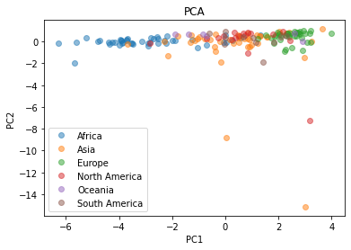\
When plotting data onto the first and third PC the following graph is obtained:\
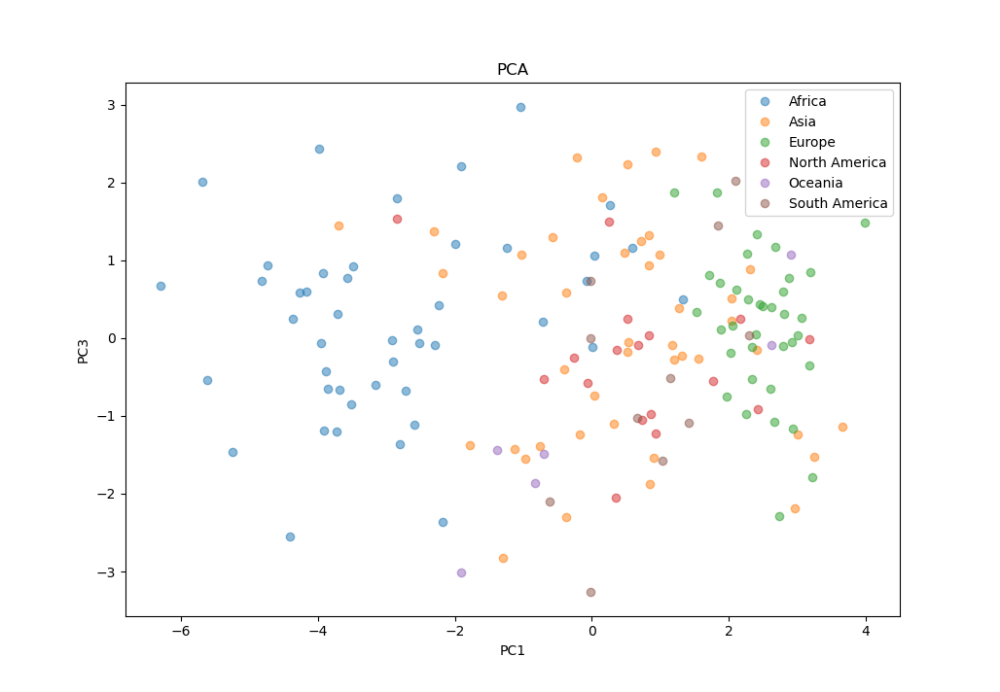\
By plotting data onto the second and third PC the following graph is obtained:\
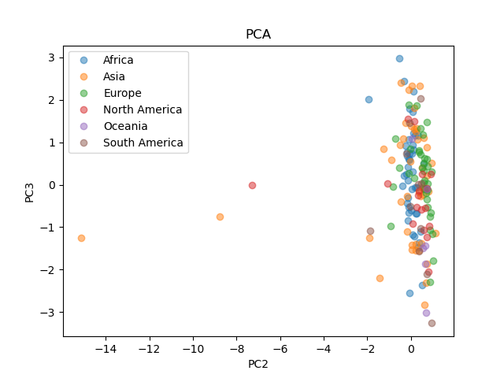\
As can be seen from the data plotted onto first and second PC, and data plotted onto first and third PC, countries from the same continents are relatively localized. This means a classification model for determining the continent of the country should be feasible.\
When plotting the data onto second and third PC the clear distinction between data points is hard to spot. An explanation of this is that combined, second and third PC only address around 23% of variation of the data.

## Exam Problems

### Question 1:
Option D: x1, time of day is interval because the attribute can be measured as time, x2-x7 are ratio because they measure the number of a certain thing and can be zero, y is ordinal because the congestion can be ranked.

### Question 2:
Option A: By following the definition of p-norm, it can be seen that the higher the p is, the closer it gets to 7. When p equals infinity, it is defined as the maximum of the individual component differences, which in this case is max(7,2) = 7

### Question 3:
Option A: To obtain the total variance singular values (values inside matrix S), need to be squared and summed, the resulting number is 670.4047. The variance explained by the first four principal components is obtained by squaring and summing the first four rows of the matrix S. The result is 5811022. In percentages then, the first four PCs explain 581.1022/670.4047 = 86.6793147%.

### Question 4:
Option D: The PC 2 is the second column in the matrix S. Time of day is the first row, Broken Truck second row, Accident victim third and Defects fifth row of the matrix S. The coefficients of the attributes can now be read from the vector (PC 2). The low values have a negative coefficient while the high valued attributes have a positive coefficient which will result in an overall positive value projection onto PC 2.

### Question 5:
Option A: Since f11 = 2, f10 = 6, f01 = 5, Jaccard similarity can be calculated as f11/(f10+f01+f11+) = 2 / 13 = 0.153846

### Question 6:
Option B: Since p(x2=0|y=2)=p(x2=0,x7=0|y=2)+p(x2=0,x7=1|y=2)=0.81+0.03=0.84.